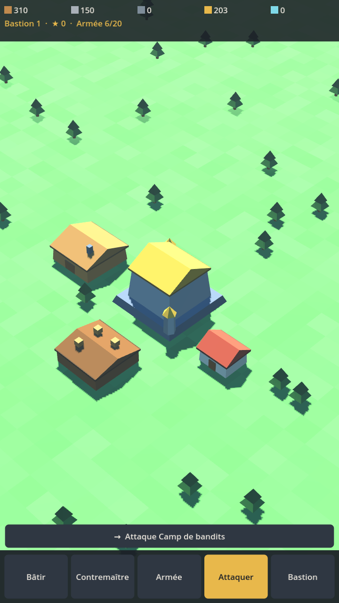
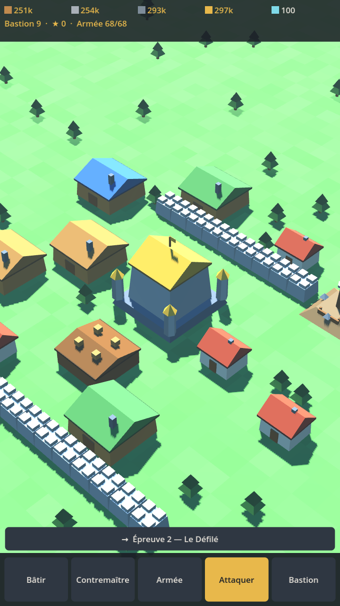
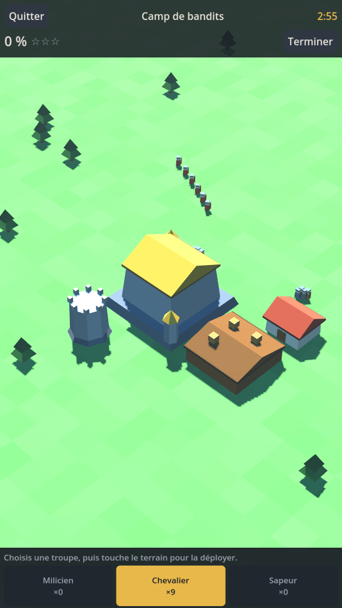

# VALDRIS — Village Builder mobile, low poly 3D, **zéro timer**

> Pitch en une phrase : un builder de village à la Clash of Clans où **rien ne se construit en attendant** — tout est instantané, et la seule vraie ressource, c'est le temps que tu passes à jouer.

**Plateforme cible** : Android (APK/AAB) d'abord, iOS ensuite.
**Moteur** : Godot 4.4 (voir docs/08 §1 pour le pourquoi).
**Style** : low poly 3D coloré, palette-atlas, 60 fps sur téléphone milieu de gamme.
**Objectif de rétention** : une session de 10h d'affilée doit être *possible et agréable*, pas une corvée.

---

## Le problème qu'on résout

Clash of Clans et ses clones ont un défaut structurel : **le jeu est conçu pour que tu arrêtes de jouer**. 3 minutes de session, puis 8 heures d'attente. C'est rentable, mais ce n'est pas un bon jeu, et ça ferme la porte au joueur qui a envie de s'installer une soirée entière dessus.

Valdris inverse le contrat :

| Clash of Clans | Valdris |
|---|---|
| Construction : 8h → 14 jours | Construction : **instantanée** (2–6 s d'animation) |
| 2–5 ouvriers = 2–5 actions en parallèle | Chantiers **illimités** |
| Le gate = le temps réel | Le gate = **ressources + compétence** |
| Session optimale : 3 min ×4/jour | Session optimale : **20 min à 10h**, au choix |
| Une seule boucle (raid → attendre) | **6 boucles de jeu** qui s'alimentent |
| Progression achetable avec des gemmes | Progression achetable en **jouant** |

---

## Les 3 verrous qui remplacent les timers

Supprimer les timers sans rien mettre à la place = jeu fini en 2h. Voici ce qui tient la progression :

1. **Verrou économique** — les coûts montent en ~1,35^n. Les ressources viennent à 65 % du butin de raid : pour construire, il faut se battre.
2. **Verrou de compétence** — chaque palier de Bastion (l'hôtel de ville) se débloque en réussissant une **Épreuve** : un défi de combat/optimisation calibré. Pas d'attente, mais il faut être bon.
3. **Verrou de stockage** — les entrepôts plafonnent. Tu ne peux pas thésauriser passivement : il faut dépenser et repartir chercher.

Détail complet : [`docs/03-economie-et-progression.md`](docs/03-economie-et-progression.md)

---

## Sommaire du plan

| # | Document | Contenu |
|---|---|---|
| 01 | [Vision & piliers](docs/01-vision-et-piliers.md) | Ce qu'on fait, ce qu'on ne fait pas, cible, références |
| 02 | [Boucles de jeu](docs/02-boucles-de-jeu.md) | Les 6 verbes, boucle 30 s / 5 min / 1h / 10h / semaine |
| 03 | [Économie & progression](docs/03-economie-et-progression.md) | Ressources, courbes, formules chiffrées, 40 paliers |
| 04 | [Systèmes du village](docs/04-systemes-village.md) | 46 bâtiments, grille, villageois, craft, layout defense |
| 05 | [Combat & PvP](docs/05-combat-et-pvp.md) | Raid temps réel, unités, héros, PvP async, déterminisme |
| 06 | [Méta, rétention & monétisation](docs/06-meta-retention-monetisation.md) | Saisons, guildes, événements, live ops, F2P éthique |
| 07 | [Direction artistique](docs/07-direction-artistique.md) | Low poly, palette-atlas, pipeline, budgets polygonaux |
| 08 | [Architecture technique](docs/08-architecture-technique.md) | Unity, ECS-lite, save, backend, anti-cheat, perf mobile |
| 09 | [Roadmap & production](docs/09-roadmap-et-production.md) | 6 jalons, vertical slice, build APK, risques |
| 10 | [Budget de contenu 10h+](docs/10-content-budget-10h.md) | Le compte exact des heures de jeu, chapitre par chapitre |

---

## Hypothèses de travail

Ce plan est écrit pour une **petite équipe (1 à 3 personnes) assistée par IA**, budget asset store modeste, sans éditeur. Si le contexte est différent (studio, budget, deadline imposée), la roadmap du doc 09 est celle qui bouge en premier — le design des docs 01→07 tient dans tous les cas.

**Durée estimée jusqu'à un APK jouable et complet** : 7 à 9 mois solo, 4 à 5 mois à trois.

---

## Le jeu

Le code vit dans [`game/`](game/) — projet Godot 4.4 jouable, avec sa propre
[documentation d'exécution](game/README.md). L'état d'avancement réel, poste par
poste, est dans [`ETAT.md`](ETAT.md).

```bash
godot --path game                                             # jouer
godot --headless --path game --script res://tests/run_tests.gd  # tests
```

Chaque push déclenche `.github/workflows/android.yml`, qui lance les tests puis
publie un **APK téléchargeable** dans les artefacts du run. Aucun secret à
configurer.

| Village | Village développé | Raid |
|---|---|---|
|  |  |  |

Captures produites automatiquement par `tests/screenshot.tscn`, sans appareil
ni écran.
